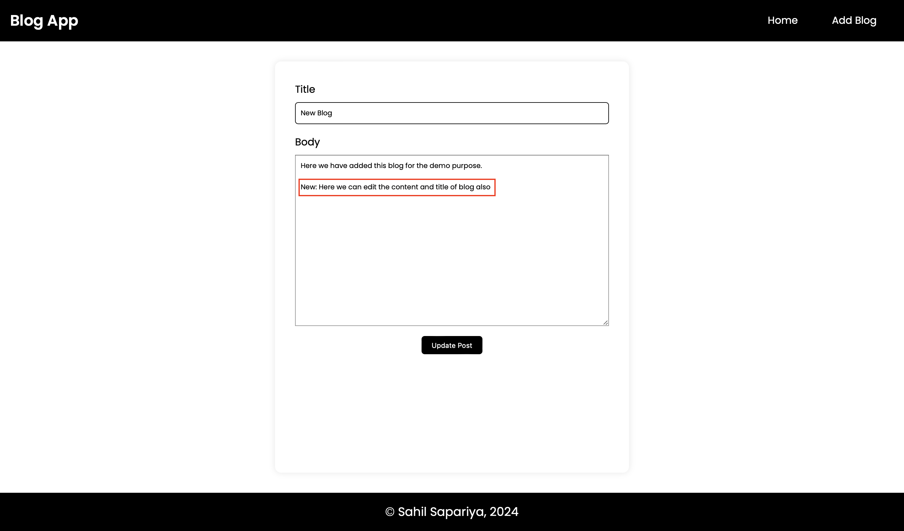

# Blog Application

This is a simple blog application built using React.js for the frontend and Spring Boot for the backend. The application allows users to perform CRUD (Create, Read, Update, Delete) operations on blog posts and provide the feature of adding and deleting the comments.

## Table of Contents

- [Features](#features)
- [Technologies Used](#technologies-used)
- [Installation](#installation)
- [Visuals](#visuals)
- [Contributing](#contributing)

## Features

### 1. Blog Post Management

**Create**: Users can create new blog posts by providing a title, content.

**Read**: Users can view existing blog posts with their titles, content.

**Update**: Users can edit existing blog posts to modify their titles, content.

**Delete**: Users can delete blog posts that they have created.

### 2. Commenting System

**Add Comment**: Users can add comments to any blog post.

**Delete Comment**: Users can delete their own comments.

### 3. Responsive Design

The application is designed to be responsive, ensuring a consistent user experience across different devices and screen sizes.

## Technologies Used

**Frontend**: React.js

**Backend**: Spring Boot

**Database**: MySQL

**API Communication**: Axios

## Installation

1.  **Clone the Repository:**

    ```bash
    git clone https://github.com/sahilsapariya/blog-application.git
    ```

2.  **Navigate to the Client Directory:**

    ```bash
    cd blog-application
    ```

3.  **Install Dependencies:**

    > For installation of client dependencies

    ```bash
    cd blog-frontend
    npm install
    ```

    > For installation of server dependencies

    It will download automatically if you have configured the java developing environment. So meaven dependency will automatically get started to install

4.  **Run the Application:**

    To run the frontend (client) part:

    ```bash
    npm start
    ```

    To run the backend part:

    > simply click on the Run button in the MainApplication file.

5.  **Access the Application:**
    - Open a web browser and go to `http://localhost:3000`.

## Visuals

### Home Screen


### View Blog Screen


### Add Blog Screen


### Blog get added


### Update Blog Screen



### Delete Blog Screen


## Contributing

If you'd like to contribute to the project, please follow these guidelines:

1. Fork the repository on GitHub.
2. Clone your forked repository (`git clone https://github.com/sahilsapariya/blog-application.git`).
3. Create a new branch for your feature or bug fix (`git checkout -b feature-name`).
4. Make your changes and commit them (`git commit -am 'Add feature'`).
5. Push to the branch (`git push origin feature-name`).
6. Create a new Pull Request on GitHub.

---
# Happy Hacking 🧑🏻‍💻 !
